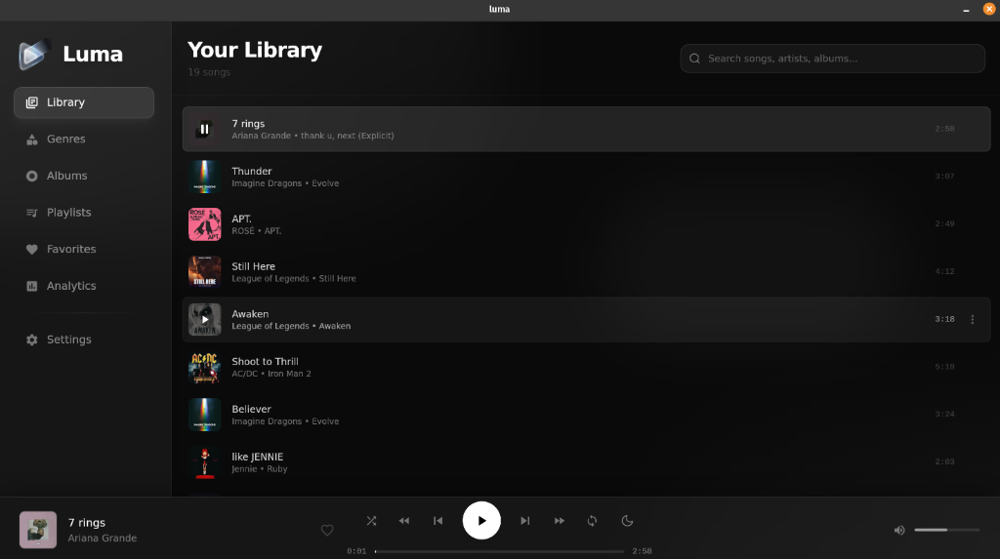

# Luma



Luma is a modern, sleek music player designed for a premium audio experience. Built with the power of **Tauri**, **React**, and **TypeScript**.

## Features

-   **Sleek Interface**: A visually immersive, dark-themed UI with smooth animations and glassmorphism effects.
-   **Library Management**: Easily organize and browse your music by Genres, Albums, and Artists.
-   **Playlists**: Create, manage, and customize your own playlists.
-   **Favorites**: Quickly access your most-loved tracks.
-   **Customizable Settings**: Tailor the experience to your preferences.

## Prerequisites

Before setting up the project, ensure you have the following installed:

- Node.js (LTS version recommended)
- Rust and Cargo (latest stable version)
- System dependencies for Tauri on Linux:
  - `libwebkit2gtk-4.0-dev` (or `libwebkit2gtk-4.1-dev`)
  - `build-essential`
  - `curl`
  - `wget`
  - `file`
  - `libssl-dev`
  - `libgtk-3-dev`
  - `libayatana-appindicator3-dev`
  - `librsvg2-dev`

## Installation

### Quick Install (Recommended for Users)
To automatically download and install the latest release directly from GitHub on any Linux distribution, run the following command in your terminal:

```bash
curl -sL https://raw.githubusercontent.com/knp-org/Luma/main/install_release.sh | bash
```

### Build from Source (For Developers)

1.  Clone the repository.
2.  Navigate to the project directory.
3.  Install the dependencies:

    ```bash
    npm install
    ```

## UI Library (`liquid-glass-ui`)

This project uses the custom `@knp-org/liquid-glass-ui` component library for its sleek glassmorphism interface. 

### Installation
During development, Luma uses a local reference to the UI library. Ensure the `liquid-glass-ui` repository is cloned in the same parent directory alongside `Luma`:
```text
parent-directory/
  ├── Luma/
  └── liquid-glass-ui/
```
In `Luma/package.json`, it is installed via the local path:
```json
"dependencies": {
  "@knp-org/liquid-glass-ui": "file:../liquid-glass-ui"
}
```

### Usage
To use the UI components, import them from the package. The global stylesheet is imported in `src/main.tsx` to apply the base styling variables:

```tsx
// In src/main.tsx
import '@knp-org/liquid-glass-ui/dist/styles/glass-components.css';
```

Then you can import and use any component or icon in your React files:
```tsx
import { GlassButton, GlassCard, IconPlaySolid } from '@knp-org/liquid-glass-ui';

function MyComponent() {
  return (
    <GlassCard>
      <GlassButton onClick={() => alert('Clicked!')} className="flex items-center gap-2">
        <IconPlaySolid size={20} />
        Play Now
      </GlassButton>
    </GlassCard>
  );
}
```

## Development

To run the application in development mode with hot-reloading:

```bash
npm run dev
```

This command will start the Vite server and the Tauri window.

## Building

To build the application for production:

```bash
npm run build
```

This will compile the React frontend and the Rust backend, producing a release build.

### Packaging

To build specific package formats for Linux, use the following commands:

-   **Debian Package (.deb)**:
    ```bash
    npm run build:deb
    ```

-   **AppImage**:
    ```bash
    npm run build:appimage
    ```

-   **RPM Package**:
    ```bash
    npm run build:rpm
    ```

-   **All Packages (using npx)**:
    ```bash
    npx tauri build
    ```
    This command builds the application for all targets defined in `tauri.conf.json`.

### Build Output

After the build process completes, the generated packages can be found in the following directories:

-   **Debian Package**: `src-tauri/target/release/bundle/deb/`
-   **AppImage**: `src-tauri/target/release/bundle/appimage/`
-   **RPM Package**: `src-tauri/target/release/bundle/rpm/`

## Project Structure

-   `src/`: Frontend React source code.
-   `src-tauri/`: Backend Rust source code and Tauri configuration.
-   `dist/`: Output directory for the frontend build.
