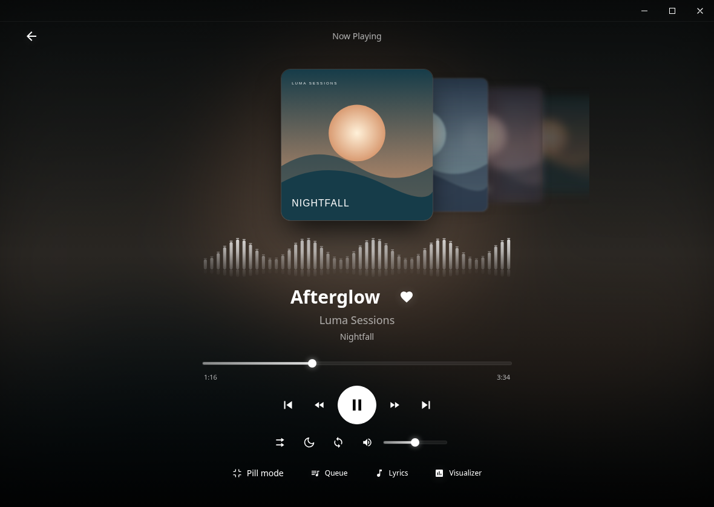
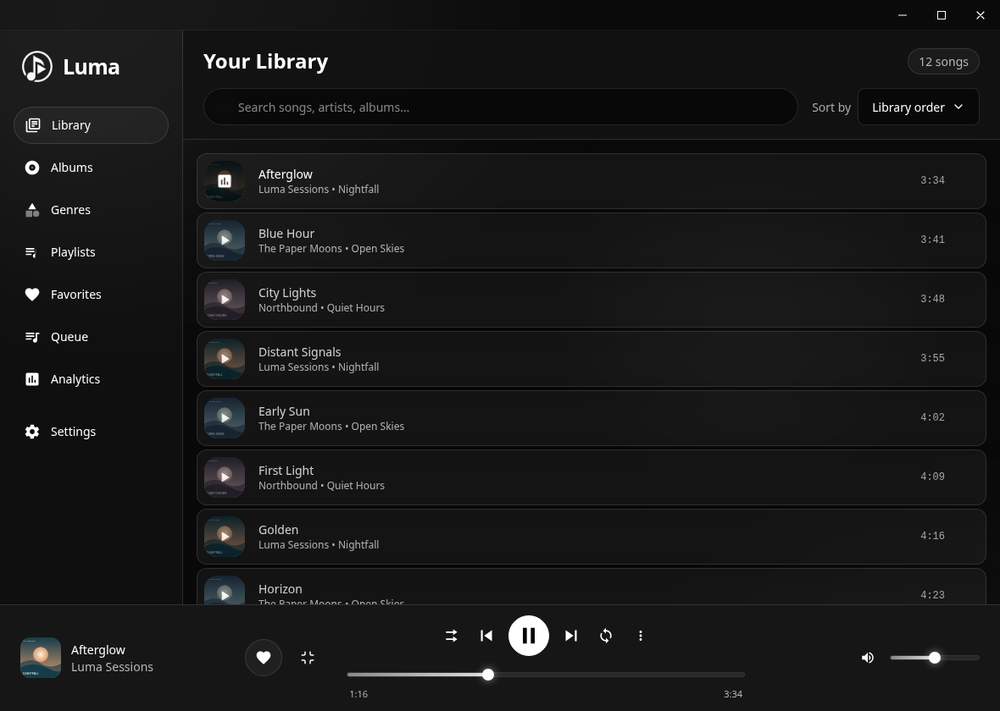
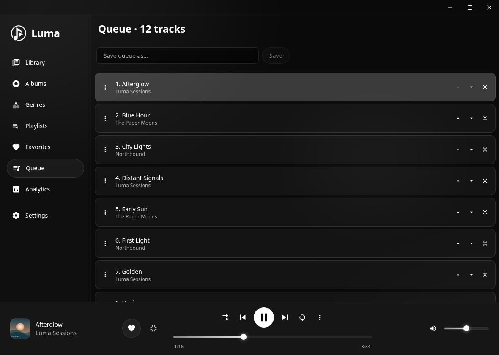

# Luma



Luma is a local music player built with Tauri, React, TypeScript, and Rust.

**Current version: 1.1.4.** Screenshots show the current interface with fictional tracks, sample artwork, and simulated playback data.

## Features

- Browse and search music by album and genre; playback follows the selected collection.
- Create playlists, mark favorites, and save the current queue as a playlist.
- Add tracks to the queue or play them next; drag to reorder, use the move buttons, or remove entries.
- Dynamic smart playlists: recently added, never played, most played, and saved genre/year filters.
- Multiple music folders, automatic file watching, incremental scans, and missing-track recovery.
- Gapless playback, optional 0–12 second crossfade, ReplayGain track normalization, and a three-band equalizer.
- Linux MPRIS integration for desktop playback controls, media keys, seeking, and volume.
- Embedded, custom, and synchronized lyrics, with optional online lookup.
- Metadata editing, listening statistics, sleep timer, and saved queue/position/volume.
- Live monochrome spectrum bars below the album art, with an on/off button in the full player.
- Floating pill player with artwork, track name, playback controls, and always-on-top positioning.

## Screenshots

### Library

Search and sort your music while keeping playback controls within reach.



### Queue

Reorder tracks with the drag handles or move buttons, remove entries, and save the queue as a playlist.



### Floating pill

A compact, always-on-top player with artwork, track name, previous/next, seek, and play/pause controls. Expand it to return to the full player.


## Development

Use Node.js 22.12 or newer and stable Rust. On Debian/Ubuntu, install the native dependencies:

```bash
sudo apt install build-essential libwebkit2gtk-4.1-dev libssl-dev libgtk-3-dev libayatana-appindicator3-dev librsvg2-dev libasound2-dev libdbus-1-dev patchelf rpm
npm ci
npm run tauri -- dev
```

`npm run dev` starts the frontend server only. Native playback and library commands require the Tauri app.

The Rust `tauri` crate and `@tauri-apps/api` stay on the same major/minor release (currently 2.9). Plugin versions are pinned to compatible releases on both sides. Update these together and commit both lockfiles; use `npm ci` to reproduce the checked-in frontend versions. The Tauri CLI and `tauri-build` have separate version schedules.

The UI library is pinned to a built package in `vendor/`; a sibling checkout and private repository credentials are unnecessary. See [vendor/README.md](vendor/README.md) for its version, source commit, checksum, and update procedure.

Use imported `@knp-org/liquid-glass-ui` components for all UI controls and surfaces: buttons, inputs/search, selects, checkboxes, sliders, cards, alerts, and dialogs. Import primitives directly at their use sites instead of adding aliases or pass-through wrappers. Compose them for music-specific screens and behavior; do not introduce replacement UI primitives or hand-drawn icons. Local CSS should handle layout, responsive sizing, and shared theme tokens. The audio spectrum canvas and artwork loading are application-specific rendering. Accessible tab groups compose `GlassButton` because the pinned `GlassTabs` API does not provide keyboard or ARIA support.

## Usage

In **Settings**, enter one full music-folder path per line and save. Automatic updates debounce filesystem changes and reuse unchanged metadata. Scan warnings are shown in Settings. Missing files stay in the library and are skipped during queue advancement. Reconnect their drive and sync, or use **Locate missing tracks** to update file paths in playlists, saved lyrics, and listening history.

A song’s menu provides **Play next** and **Add to queue**. Open **Queue** from the sidebar or the full player to reorder, remove, or save tracks. Drag the dotted handle beside a track to reorder; holding near the list edges scrolls automatically. Escape cancels a drag, and the move buttons also work with the keyboard. Smart playlists appear on the Playlists page; their rules stay dynamic, while saving a queue creates a regular playlist snapshot.

Use **Sort by** in Library or Favorites to order tracks by title, artist, album, or recently added. Search and sorting stay above the scrolling list; playing a result follows that displayed order. In smaller windows, the navigation button at the top opens all screens.

Open the full player by clicking the current track in the bottom bar. Seek backward and forward sit directly beside play/pause, with previous and next track outside them. Change the seek interval in **Settings** to 5, 10, 15, or 30 seconds.

The full player uses a single **Queue / Lyrics** panel with keyboard-accessible tabs. **More playback controls** in the bottom bar opens seek shortcuts and the sleep timer, plus volume on smaller windows. Sliders show position/volume previews and support keyboard adjustment; dragging the seek slider commits when released.

Use **Pill mode** in the full player, or the floating-player icon in the bottom bar, to shrink Luma to a draggable 420 × 80 window. Drag the artwork or track name to move it. The expand button or Escape opens the full player and restores the previous window size, position, and pinning state, including when pill mode was opened from the library. With no track selected, it returns to the main app. Playback and the queue continue through mode changes.

In the full player, the **Visualizer** button turns the monochrome spectrum bars below the album art on or off. The app remembers this preference. Visuals follow the decoded audio, EQ, crossfade, and player volume. They settle when paused or muted, suspend while the window is hidden, and update less often with reduced motion enabled. They require native playback in the Tauri app.

Audio settings apply when saved. Crossfade takes precedence over gapless transitions when its duration is above zero. ReplayGain uses existing track gain/peak tags; untagged tracks retain their original level. EQ boosts reserve headroom. The continuous transition engine mixes stereo at 48 kHz; it does not provide bit-perfect output or automatic loudness analysis. Unsupported or unavailable files show playback errors without incrementing their play counts.

Desktop media controls require a running Linux session D-Bus. If it is unavailable, in-app controls remain usable. The online lyrics action sends the selected track’s title, artist, album, and duration to LRCLIB and has a 15-second timeout.

Library and Favorites lists render only visible rows plus a small buffer. Artwork requests share an LRU cache capped at 256 entries and approximately 32 MiB of retained strings. Full-resolution artwork currently displayed by components also consumes memory outside that cache.

Playback persistence migrates the previous saved state automatically. Queue changes are saved separately from small five-second position checkpoints; matching revisions prevent restoring a position against a different queue after an interrupted save. The monochrome visualizer draws at most 60 frames per second, reuses its gradients, and precomputes frequency bands. The folder watcher scans changed files or subfolders and falls back to a full scan after event loss or drive changes.

### Keyboard controls

| Key | Action |
| --- | --- |
| Space | Play or pause |
| Left / Right arrow | Seek backward / forward by the configured interval |
| Up / Down arrow | Increase / decrease volume by 5% |
| Escape in pill mode | Open the full player |
| Escape during a queue drag | Cancel the move |
| Escape in the full player | Close the active panel or return to the main app |

Playback shortcuts apply when focus is outside form controls, buttons, and dialogs. Focused controls retain their own keyboard behavior.

## Validation

```bash
npm test
npm run build
cargo test --locked --manifest-path src-tauri/Cargo.toml --lib
cargo check --locked --manifest-path src-tauri/Cargo.toml
```

Frontend regressions cover player controls, collection queues, queue dragging and cancellation, pill window restoration and retries, smart playlists, metadata IPC, bounded list rendering, artwork cache eviction, and playback checkpoint migration. Pill tests mock native window operations; verify desktop floating and restoration behavior in the Tauri app as well. Rust tests exercise sample-level transitions and ReplayGain, real WAV metadata/cache round trips, corrupt-file scanning, overlapping folders, and disconnected-drive recovery. These tests use temporary files and require no sound device.

## Packaging

```bash
npm run build:deb
npm run build:appimage
npm run build:rpm
npm run build:all
```

`npm run build` compiles the frontend. The packaging commands compile the frontend and Rust backend and place installers in `src-tauri/target/release/bundle/`. CI runs both regression suites and installs frontend dependencies from the lockfile.

For version 1.1.4 on x86-64 Linux, the Debian output is `src-tauri/target/release/bundle/deb/Luma_1.1.4_amd64.deb`. Install the locally built package from the repository root:

```bash
sudo apt install ./src-tauri/target/release/bundle/deb/Luma_1.1.4_amd64.deb
```

When changing the application version, keep `package.json`, the root entries in `package-lock.json`, `src-tauri/Cargo.toml`, the `luma` entry in `src-tauri/Cargo.lock`, and `src-tauri/tauri.conf.json` aligned.

## Install a release

The installer below fetches the latest published [GitHub release](https://github.com/knp-org/Luma/releases). To install your local build, use the Debian command above.

```bash
curl -sL https://raw.githubusercontent.com/knp-org/Luma/main/install_release.sh | bash
```
